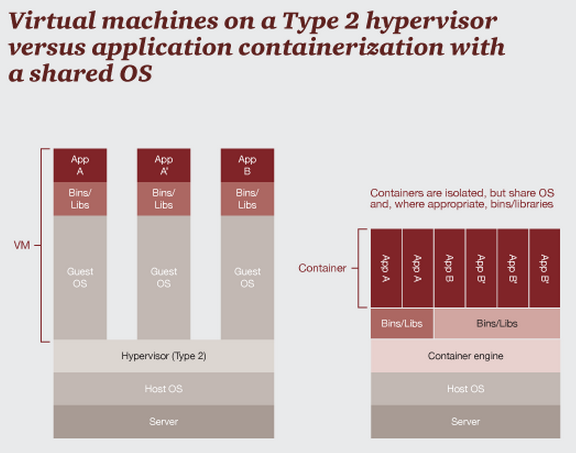

name: inverse
layout: true
class: center, middle, inverse
---
# Using reproducible container based environments
---
layout: false
### Why do we need containers?

- Science Reproducibility

--

    - Each project in a lab depends on complex software environments
        - operating system
        - drivers
        - software dependencies: Python/MATLAB/R + libraries
--

    - We try to avoid
        - the computer I used was shut down a year ago, can’t rerun the results from my publication...
        - the analysis were run by my student, have no idea where and how...
        - etc.
---
### Why do we need containers?
--

- Collaboration with your colleagues
--

    - Sharing your code or using a repository might not be enough
--

    - We try to avoid
        - well, I forgot to mention that you have to use Clang, gcc never worked for me... 
        - don’t see any reason why it shouldn’t work on Windows...(I actually have no idea about Windows, but won’t say it...)
	- it works on my computer...
	- etc.
---
## Why do we need containers?

- Freedom to experiment!
--


Universal Install Script from xkcd: The failures usually don’t hurt anything... Usually all your old programs work...
--

    - We try to avoid
        -I just want to Undo the last five hours of my life...
---
### Virtual Machines and Container Technologies

- Main idea: isolate the computing environment
    - Allow regenerating computing environments
    - Allow sharing your computing environments

--

- Two types:
    - Virtual Machines
        - Virtualbox
	- VMware
	- AWS, Google Compute, ...
    - Containers (?)
        - Docker
	- Singularity
--

- The details differ (and matter depending on application)

---
### Virtual Machines vs Container #TODO


---
### Virtual Machines vs Container #TODO


---
### Docker
- leading software container platform
- an open-source project
- bundle libraries and required settings only (not a full operating system)
- more lightweight to deploy and faster to start up than VM

--
- testing your Docker installation:
```bash
$ docker run hello-world
```
---

## Docker

- Using existing images
--

```bash
$ docker pull busybox
$ docker images
$ docker run busybox
$ docker run busybox echo ``hello from busybox''
$ docker run -it busybox sh
$ docker ps
$ docker rm
$ docker run -it --rm busybox
$ docker run -it --rm -v YourDirectory:/src busybox
```

---
### Docker: Installing software with Dockerfile

- Dockerfile content:

```bash
# TODO: update image (Satra)
FROM bids/base_fsl
RUN apt-get update -y && apt-get install -y r-base
```

--

- Building a new container:

```bash
$ docker build -t fslR .
```

--

- Running your new container:

```bash
$ docker run -ti --rm fslR
```

---
### Check the generated info!

  - Once run, you should now have a directory with your subject, and a sub-directory `info`.

    - In there, you can see a `dicominfo.txt` - we'll be using the information here to convert to a file structure (BIDS)
--

---
### Put the guts in your heuristic!
  - For this example, we want to extract T1, diffusion, and the face matching task

--

  - First, define the keys
  ```python
  t1 = create_key('anat/sub-{subject}_T1w')
  dwi = create_key('dwi/sub-{subject}_acq-{acq}_dwi')
  facematch=create_key('func/sub-{subject}_task-facematch_run-{item:02d}_bold')
  info = {t1:[], dwi:[], facematch:[]}
  ```
--

  - And now for each key, look at the `dicominfo.txt` and set a unique criteria that only that series will meet. For example:
--

    ```python
    for idx, s in enumerate(seqinfo):
        x,y,sl,nt = (s[6], s[7], s[8], s[9])
        if (sl == 176) and (nt ==1) and ('T1_MPRAGE' in s[12]):
            info[t1].append(s[2])
    ```
---
### Test it out!
  - After setting rules for each key, re-run `heudiconv` with some added parameters:

--

    - `-c dcm2niix` - this sets the converter that will be used (dcm2niix is recommended)
    - `-f my_heuristic.py` - this tells heudiconv to look for the specific keys you defined when converting
    - `-b` - this flag tells `dcm2niix` to output BIDS metadata `json` files.
--

  - Something missing? Double check your `heuristic.py` and `dicominfo.txt`!
---
### Is it BIDS yet?
  - 90% there, but (currently) you will have to fix any errors from the validator.

<h2>BUT</h2>

  - A change to `heudiconv` will be coming soon that fixes most, if not all, of these problems.
---
name: inverse
layout: true
class: center, inverse
---
# <u>Thanks</u>


<h3> Satra Ghosh </h3>
<br>
<h3> Chris Gorgolewski </h3>
<br>
<h3> Heudiconv contributors </h3>
---
name: inverse
layout: true
class: center, middle, inverse
---
# Questions?
